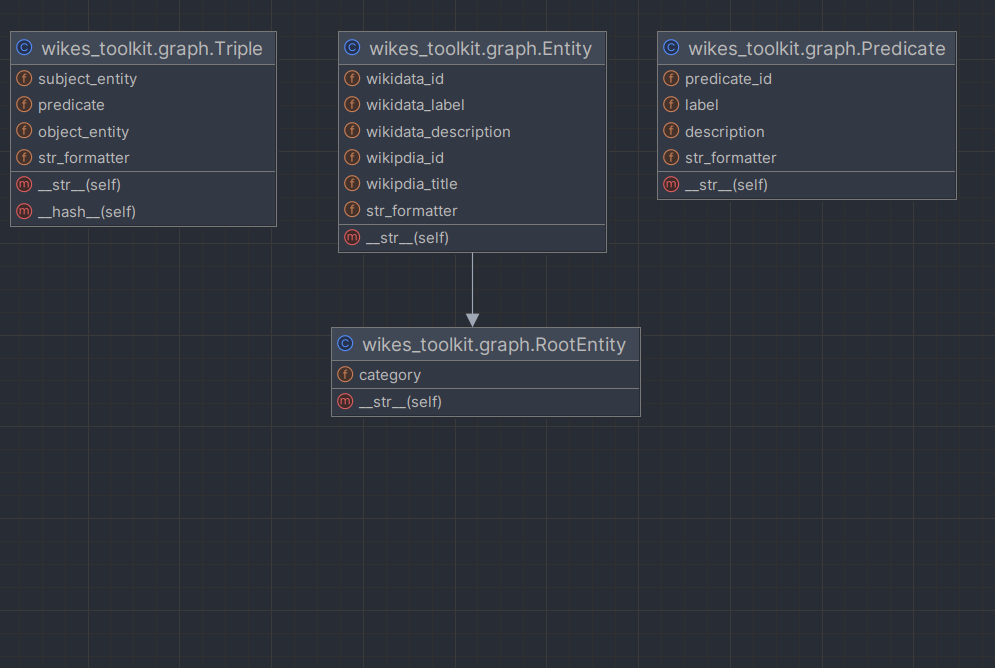
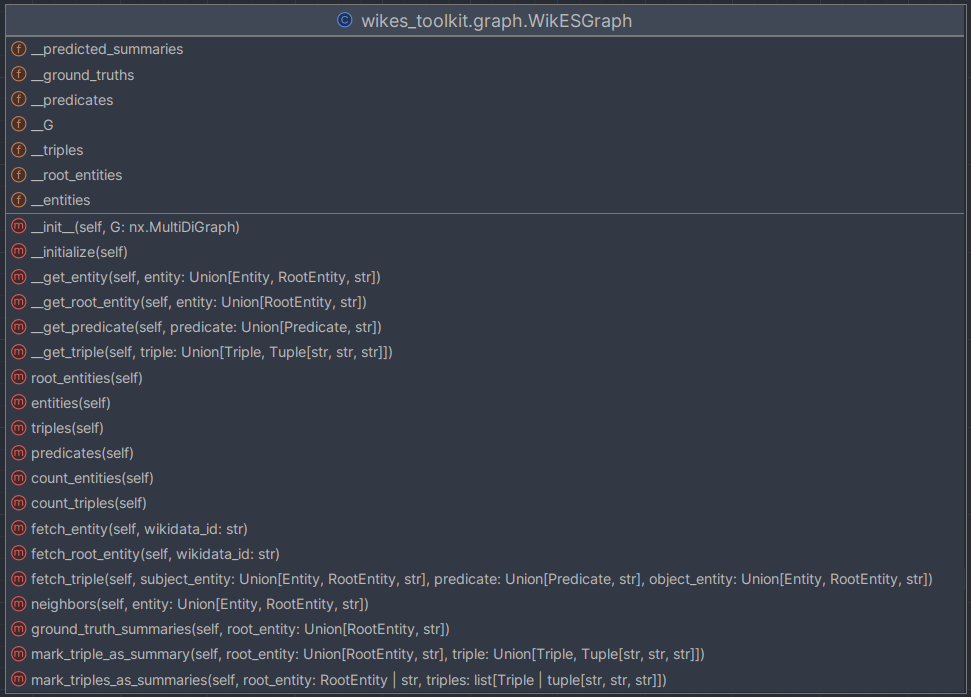
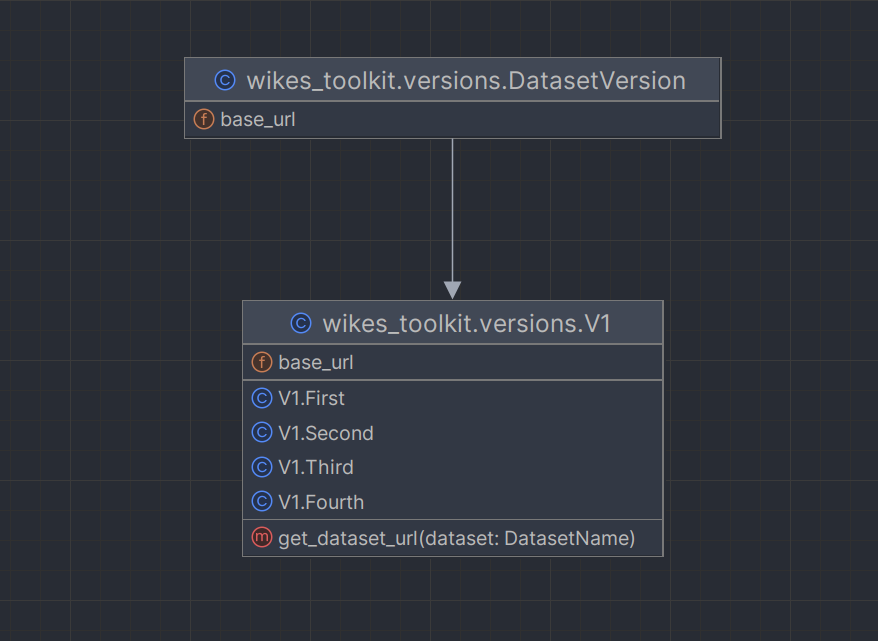
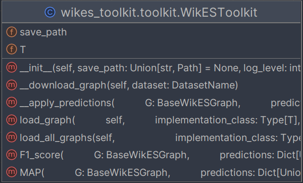

# wiki-entity-summarization-toolkit

A user-friendly toolkit for the Wiki-Entity-Summarization (WikES) datasets.
It provides functionalities for downloading, loading, and working with 48 pre-generated graph datasets, as well as
evaluating predictions against the ground truth.

## Installation

```bash
pip install wikes-toolkit
```

## Available methods:






## Usage

```python
from wikes_toolkit import WikESToolkit, V1

toolkit = WikESToolkit()
G = toolkit.load_graph(
    V1.First.SMALL_FULL,
    entity_formatter=lambda e: f"Entity({e.wikidata_label})",
    predicate_formatter=lambda p: f"Predicate({p.label})",
    triple_formatter=lambda
        t: f"({t.subject_entity.wikidata_label})-[{t.predicate.label}]-> ({t.object_entity.wikidata_label})"
)   

root_nodes = G.root_entities()
nodes = G.entities()
edges = G.triples()
labels = G.predicates()
number_of_nodes = G.count_entities()
number_of_edges = G.count_triples()
node = G.fetch_entity('Q303')
node_degree = G.degree('Q303')
neighbors = G.neighbors(node)
# or  G.neighbors('Q303')
ground_truth_summaries = G.ground_truth_summaries(root_nodes[0])
# or G.ground_truth_summaries('Q303')
G.mark_triple_as_summary(root_nodes[0], edges[0])
# or G.mark_triple_as_summary(root_nodes[0], ('Q303', 'P241', 'Q9212'))
# or G.mark_triple_as_summary('Q303', ('Q303', 'P264', 'Q898618'))
# or G.mark_triples_as_summaries(root_nodes[1], [G.neighbors(root_nodes[1])[0], G.neighbors(root_nodes[1])[1]])


for root in G.root_entities():
    print(f"Neighbors of [{root}]:")
    for triple in G.neighbors(root):
        print(triple)

    for _ in range(5):
        print("*" * 40)

    print("Ground truth summaries:")
    for summary in G.ground_truth_summaries(root):
        print(summary)
    G.mark_triples_as_summaries(root, G.neighbors(root))
    break

""" Output of the above code:
Neighbors of [Entity(Elvis Presley)]:
(Elvis Presley)-[military unit]-> (32nd Cavalry Regiment)
(Elvis Presley)-[genre]-> (blues)
...
(Jim Morrison)-[influenced by]-> (Elvis Presley)
(Elvis Country – I'm 10,000 Years Old)-[performer]-> (Elvis Presley)
(The King)-[main subject]-> (Elvis Presley)
****************************************
Ground truth summaries:
(Elvis Presley)-[genre]-> (rockabilly)
(Million Dollar Quartet)-[has part(s)]-> (Elvis Presley)
(Jailhouse Rock)-[cast member]-> (Elvis Presley)
...
(Viva Las Vegas)-[cast member]-> (Elvis Presley)
(Elvis Presley)-[genre]-> (rhythm and blues)
(Elvis Presley)-[record label]-> (Sun Records)
(Elvis Presley)-[genre]-> (pop music)
"""

for dataset_name, G in toolkit.load_all_graphs(V1):
    print(f"Dataset [{dataset_name}:")
    print(G.root_entities())

```

## Project Details

This toolkit is part of
the [Wiki-Entity-Summarization project (WikES)](https://github.com/msorkhpar/wiki-entity-summarization).

## License

This project is licensed under the MIT License. See the [LICENSE](LICENSE) file for details.
